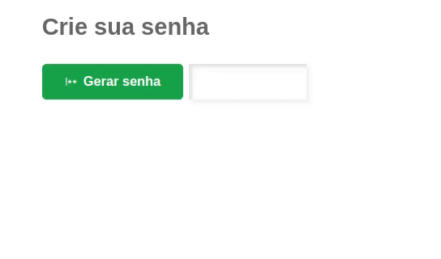

## Aplicação simples - Gerador de senhas

Aplicação tem o objetivo em ajudar na criação de senhas, que no meu caso é sempre dificil pensar numa boa 😅.

<a href="">Aplicação online</a>

A tecnologia que eu escolhi para construir está aplicação foi o Javascript em conjunto com a linguagem de marcação de texto HTML e a linguagem de estilos CSS.

